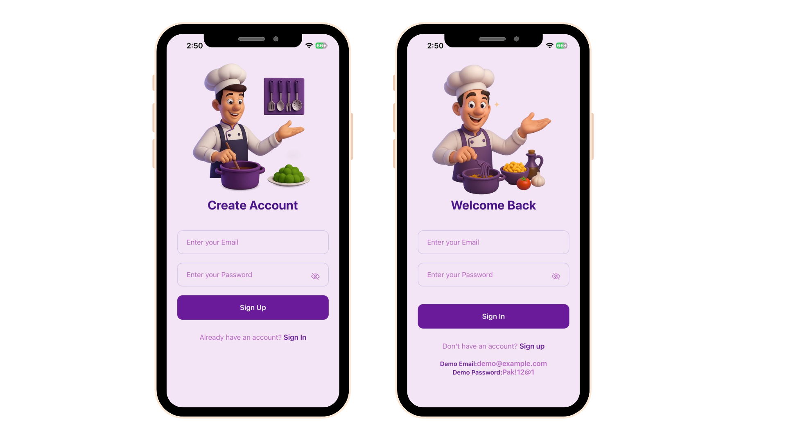
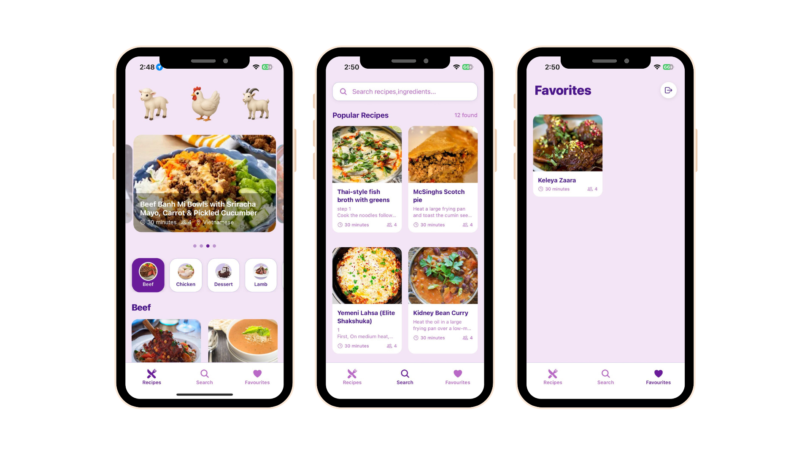
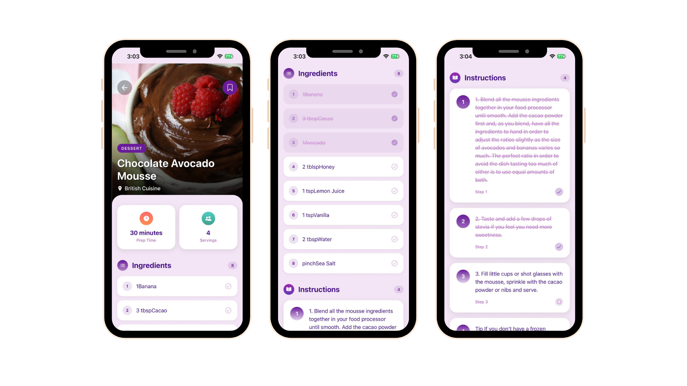

# Recipe Finder 

A full-stack recipe discovery app with a React Native (Expo) client and an Express + Drizzle backend for user favourites.

## Project Overview

`Recipe Finder` helps users:
- Browse and search recipes
- View recipe details
- Save and manage favourites
- Use the app across Android, iOS, and Web via Expo

The project is split into two apps:
- `mobile/` → Expo React Native frontend
- `backend/` → Node.js API for favourites persistence

## Screenshots

### Auth Flow


### Tabs


### Recipe Details


## Tech Stack

### Frontend (`mobile`)
- React Native + Expo
- Expo Router
- Clerk (`@clerk/clerk-expo`) for authentication
- React Navigation
- Custom reusable components and style modules

### Backend (`backend`)
- Node.js + Express
- Drizzle ORM + Drizzle Kit
- Neon Postgres (`@neondatabase/serverless`)
- dotenv

## Repository Structure

```text
Recipe Finder/
├─ backend/
│  ├─ drizzle.config.js
│  ├─ src/
│  │  ├─ server.js
│  │  ├─ config/
│  │  │  ├─ db.js
│  │  │  └─ env.js
│  │  ├─ controllers/
│  │  │  └─ favourites.js
│  │  ├─ db/
│  │  │  ├─ schema.js
│  │  │  └─ migrations/
│  │  └─ routes/
│  │     └─ favourites.js
│  └─ package.json
├─ mobile/
│  ├─ app/
│  ├─ components/
│  ├─ constants/
│  ├─ services/
│  └─ package.json
└─ .gitignore
```

## API Base URL

In `mobile/constants/api.js`, the app currently points to:

```js
export const API_URL = 'https://receipe-app-api.vercel.app/api/' (can be updated to your local backend URL for development);
```

If you run backend locally, update this value to your local server URL (for example `http://<your-local-ip>:5001/api/`).

## Backend API Endpoints

Base path: `/api`

- `GET /health` → health check
- `POST /favourites` → create favourite
- `GET /favourites/:userId` → list user favourites
- `DELETE /favourites/:userId/:receipeId` → remove favourite

## Environment Variables

Create `backend/.env`:

```env
PORT=5001
DATABASE_URL=your_neon_or_postgres_connection_string
NODE_ENV=development
```

> `backend/src/config/env.js` reads `PORT`, `DATABASE_URL`, and `NODE_ENV`.

For the mobile app, add your Clerk public key in Expo env config if required by your auth setup.

## Local Development Setup

## 1) Clone

```bash
git clone https://github.com/iTalhaZahid/recipe-finder-app.git
cd recipe-finder-app
```

## 2) Install dependencies

```bash
cd backend
npm install
cd ..\mobile
npm install
```

## 3) Run backend

```bash
cd ..\backend
npm run dev
```

Backend starts on `http://localhost:5001` by default.

## 4) Run mobile app

```bash
cd ..\mobile
npx expo start
```

Then choose Android/iOS/Web from the Expo CLI options.

## Available Scripts

### Backend
- `npm run dev` → start backend with nodemon
- `npm start` → start backend with Node

### Mobile
- `npm run start` → start Expo dev server
- `npm run android` → run on Android
- `npm run ios` → run on iOS
- `npm run web` → run in browser
- `npm run lint` → lint project

## Notes

- `.gitignore` is configured at repo root to ignore `node_modules` and `.env` files.
- This repo uses a monorepo-like layout with one root git repository and two app folders.
